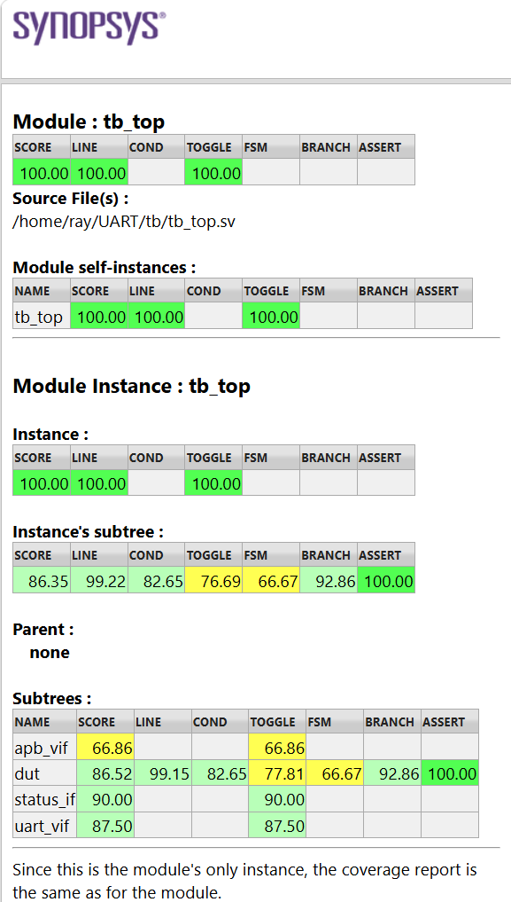

# APB4 UART Verification

A SystemVerilog/UVM verification project for an APB4 UART controller with FIFO, error-status, and interrupt behavior.

## Project overview

This project provides a coverage-driven UVM environment for APB4 register transactions, UART transmit/receive behavior, FIFO boundaries and corner cases, error reporting, and interrupts.

## DUT origin and APB4 context

The original/ directory preserves the Vyges source package and Apache-2.0 licensing/origin material. This repository focuses on APB4 verification: UVM agents, scoreboard/reference modeling, assertions, functional coverage, directed tests, and regression support. Repository history records an APB4 UART RTL baseline and APB4 coverage work. The current controller exposes PSTRB and PPROT.

## Verification architecture

- APB agent: compliant APB SETUP/ACCESS driver and monitor.
- UART agent: serial-traffic driver plus TX/RX monitors.
- Scoreboard/reference model: register, FIFO, UART, and status checking.
- Assertions: error propagation, FIFO-read safety, and TX-empty/RX-full IRQ behavior.
- Functional coverage: parity, errors, FIFO states/corners, and interrupts.

## Verified scope

APB register access and byte strobes; UART TX/RX; FIFO empty/middle/full; TX write while full; RX receive while full; RX read while empty; parity modes/errors; frame error; overrun; TX-empty IRQ; and RX-full IRQ are verified. See [verification plan](docs/verification_plan.md).

## Coverage results

Whole-simulation URG totals include UVM/Verdi recording instrumentation, so portfolio interpretation uses DUT scope.

| Scope | Result |
|---|---:|
| Functional coverage groups | **100.00%** |
| Assertion coverage | **100.00%** |
| DUT subtree line / branch / condition / toggle / FSM | **99.15% / 92.86% / 82.65% / 77.81% / 66.67%** |
| uart_controller line / branch / condition / toggle | **100.00% / 100.00% / 83.93% / 66.57%** |

Functional and assertion coverage are complete; condition, toggle, and DUT-subtree FSM coverage retain reviewed gaps. See [coverage summary](docs/coverage_summary.md).

## Known RTL design gaps

- CTRL parity bits feed internal nets, but TX/RX parity uses compile-time parameters; runtime parity control is not implemented.
- PPROT is present but not consumed by controller RTL.
- Some CTRL and INT bits are writable but functionally unused; reset-only fields are distinguished in the coverage summary.

## Build, run, and regression

~~~bash
make compile
make run_test TEST=uart_rx_test
make frame_error
make tx_empty_irq
make rx_full_irq
make regression
make final_coverage
make final_merge
make verdi
~~~

The Makefile supports parity, error, FIFO, IRQ, and APB register coverage targets. Generated VDB, URG, simulator, and log artifacts are not release content.

## Tools used

SystemVerilog, UVM 1.2, Synopsys VCS, URG, and optional Verdi/FSDB integration.

## Repository structure

~~~text
dut/       UART RTL and submodules
tb/        UVM environment, agents, tests, assertions, coverage
docs/      Coverage analysis, verification plan, and release image
original/  Preserved upstream source and attribution material
Makefile   Compilation, tests, coverage regression, merge, and Verdi flow
~~~

## Future work

Specify runtime parity, PPROT, reserved-register, and unaligned-address intent; add unsupported-access and global-enable robustness tests; and add CI where licensed tools are available.

## Attribution

DUT-origin material and license notices are preserved under original/. The UVM verification environment and project documentation are maintained in this repository.

## Verification Hardening Update

### Hardening Highlights

- Unsupported TXDATA-read/RXDATA-write APB accesses return `PSLVERR` without corrupting valid RX data.
- Reset recovery during APB SETUP/ACCESS, active TX, and an external RX frame is covered.
- Full-duplex TX/RX overlap and simultaneous `TX_BUSY`/`RX_BUSY` are checked.
- Global-enable TX gating retains queued data until `ctrl_enable` is asserted.
- APB4 SVA/cover properties cover phase sequencing, stable controls, completion, strobes, errors, and the DUT-specific zero-wait response.

### Hardening Regression

| Test | Purpose | Result |
|---|---|---:|
| `apb_register_access_test` | APB register access | PASS |
| `apb_unsupported_access_test` | Unsupported access direction | PASS |
| `apb_reset_during_transfer_test` | APB runtime reset/recovery | PASS |
| `uart_tx_reset_test` | TX reset recovery | PASS |
| `uart_rx_reset_test` | RX reset recovery | PASS |
| `uart_simultaneous_tx_rx_test` | Full-duplex overlap | PASS |
| `uart_global_disable_tx_test` | Global-enable TX gating | PASS |

Verified local Synopsys VCS/URG result: 7/7 PASS; `UVM_WARNING=0`, `UVM_ERROR=0`, `UVM_FATAL=0`.

### Final Coverage

| Metric | Result |
|---|---:|
| Functional coverage | **100.00%** |
| `uart_controller` line / condition / branch / toggle | **100.00% / 87.50% / 100.00% / 69.48%** |
| DUT subtree line / condition / toggle / FSM / branch | **99.21% / 83.67% / 80.72% / 77.78% / 88.37%** |
| Assertion coverage | **89.19%** |

The global URG total is not the primary project metric because UVM/Verdi instrumentation lowers it. Remaining holes are reviewed: zero-wait APB has no wait-state hit, the word-aligned map keeps `PADDR[1:0]` static, `PPROT` is unused, and residual protocol/topology and assertion failure branches are low verification-value combinations.
